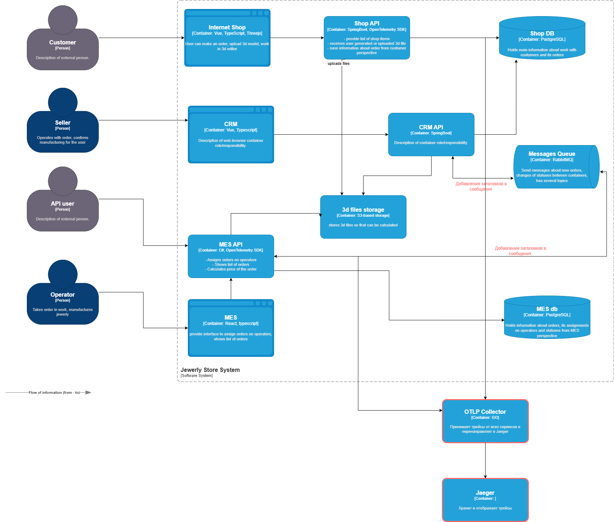

# Системы которые стоит покрыть трейсингом

На данный момент трейсингом стоит покрыть системы InternetShop и Mes.    
Так как они являются основными входными точками для клиентов александрита по работе с заказами,  
где и сосредоточено большая проблем. 

# Мотивация 

На данный момент при возникновении проблем с заказами сложно сказать в каком именно сервисе произошла ошибка.  
Трассировка позволит отслеживать путь запроса между сервисами, время и ошибки во время его выполнения.  
Благодаря возможностям трассировки:  
- При обращении клиентов в поддержку можно будет понять в каком именно сервисе возникла проблема.  
- При тестировании можно будет делиться трейсом с разработчиком, что ускорит процесс исправления багов.  
- Выявление узких мест в системе станет проще. 

# Предлагаемое решение 

В качестве инструментов для реализации трассировки запросов использовать: 
- OpenTelemetry - стандарт по сбору и передачи информации в Jaeger
- Jaeger - отображение и работа с трейсами 
## Доработка компонентов системы
### 1. Инструментация приложений
- **Онлайн-магазин (Java Spring Boot)**:  
  - Внедрить **OpenTelemetry Java Agent** для автоматической трассировки HTTP-запросов.  
  - Добавить ручную инструментацию для ключевых операций:  
    ```java
    // Пример для загрузки 3D-модели
    try (Scope scope = tracer.spanBuilder("upload_3d_model").startScopedSpan()) {
        scope.span().setAttribute("user.id", userId);
        // Логика загрузки...
    }
    ```

- **MES (C#)**:  
  - Использовать **OpenTelemetry .NET SDK** для трассировки расчета стоимости и производства.  
  - Модифицировать обработчики RabbitMQ для извлечения/передачи контекста:  
    ```csharp
    using var activity = activitySource.StartActivity("process_manufacturing_order");
    var traceId = message.Headers["trace_id"];
    activity?.SetTag("rabbitmq.queue", "manufacturing");
    ```

### 2. Настройка асинхронной трассировки (RabbitMQ)
- **Доработки**:  
  - Добавить заголовки `trace_id`, `span_id` во все сообщения, связанные с заказами.  
  - Модифицировать потребителей (MES, CRM) для восстановления контекста из заголовков.  
- **Формат сообщения**:  
  ```json
  {
    "headers": {
      "trace_id": "abc123",
      "span_id": "def456"
    },
    "body": { ... }
  }


# Компромиссы 

- Затраченное время команды на внедрение. Усугубляется если ни у кого в команде нет опыта. 
- Затраченные ресурсы инфраструктуры на хранение и обработку трейсов. 
- Может ухудшить общую производтельность
- Настройка трассировки для асинхронных сценариев (Rabbit) может потребовать дополнительных усилий.


# Безопасаность 

- Обеспесить доступ к Jaeger только с внутренней сети 
- Внедрение аутентификации и авторизации 
- Обфускация чувствительных данных 

