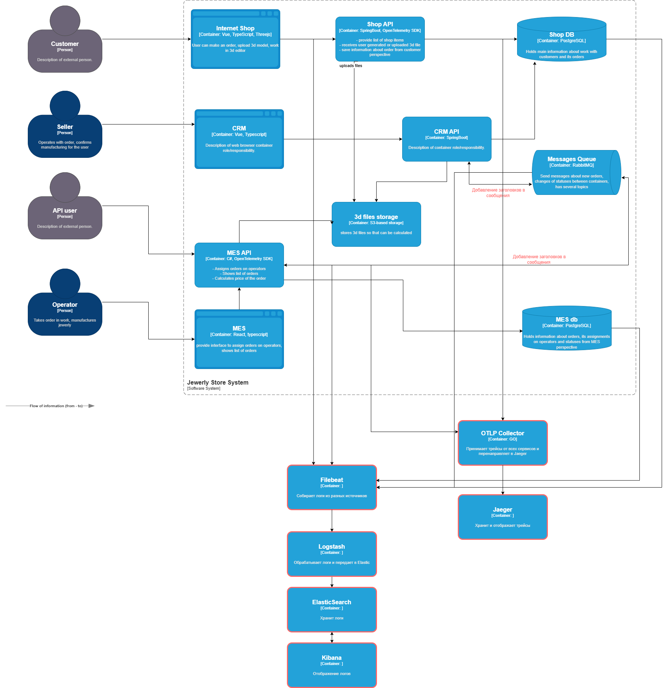

# Какие логи стоит собирать 
Компоненты в которых нужно собирать логи с уровнем INFO:
- **MES** - изменение статусов заказов, время затраченное на расчет стоимости
- **SHOP** - изменение статусов заказов
- **MES DB** - медленные запросы
- **Shop DB** - медленные запросы
- **RabbitMQ** - сообщение в dead-letter queue

Какие еще уровни логирования использовать: 
- **DEBUG**: Для отладки расчета стоимости в MES (включая промежуточные шаги).  
- **ERROR** для сбора всех возможных ошибок в сервисах (таймауты запросов, недоступность сервиса и подобные). Все 500 ответы
- **WARN** ключевые запросы, которые выполняются медленнее чем ожидалось. Критичные ошибки валидации 

# Мотивация

**Грамотно настроенная система логирования позволяет**:
- Детально анализировать инциденты и точно определять их причины. Следовательно быстрее их устранять
- Восстановить порядок пользовательских действий и системных вызовов для воспроизводения багов 
- Отследить медленные и проблемные запросы в БД  
- Отслеживать состояние системы 

**Технические метрики на которые может повлиять логирование**:  

- Уменьшение количества ошибок 
- MTTR уменьшение количества времени на устранение ошибок
- Процент успешных расчетов стоимости

**Бизнес метрики на которые может повлиять логирование**:  

- Процент потерянных заказов 
- Конверсия. Во время обработанная ошибка, позволит исправить ее и 
- NPS. Благодаря во время исправленным проблемам пользователь будет более лоялен к продукту

# Предлагаемое решение
**В качестве решения предлагаю воспользоваться известным ELK стеком, который состоит из:**
- **Filebeat** для сбора логов 
- **Elasticsearch** для хранения и быстрого поиска
- **Kibana** для визуализации 
- **Logstash** для обработки и обогащения логов.  

**Какие доработки потребуются**
- В MES, CRM и SHOP API нужно внедрить структурное логирование, если его еще нет и добавить логи во всех критичных местах + настроить middleware для логирования всех 5xx ошибок.
- Во всех системах где нужно собирать логи нужно внедрить Filebeat и настроить конфигурацию на отправку в Logstash
- Настроить Elasticsearch и Kibana с индексами и ILM для оптимального хранения

**Политика безопасности**
- Маскировать чувствительные данные 
- Разделить роли с доступам к логам
- Доступ только с внутренним VPN для сотрудников

# Cистема анализа логов

Можно использовать Kibana Alerting: Для триггеров на основе запросов к Elasticsearch.

**Примеры алертов**:  

Технические:
- http_500_errors{service="mes"} > 10 за 5 мин → Уведомление в Slack/Telegram.
- rabbitmq_queue_messages{queue="dlx"} > 50 за 1 час → Email DevOps.

Бизнес: 
- rate(order_status_changed{status="SHIPPED"}[1h]) < 5 → Предупреждение о замедлении доставки.

Аномалии: 
- Резкий рост запросов:
- Более 10 неудачных попыток аутентификации с одного IP

